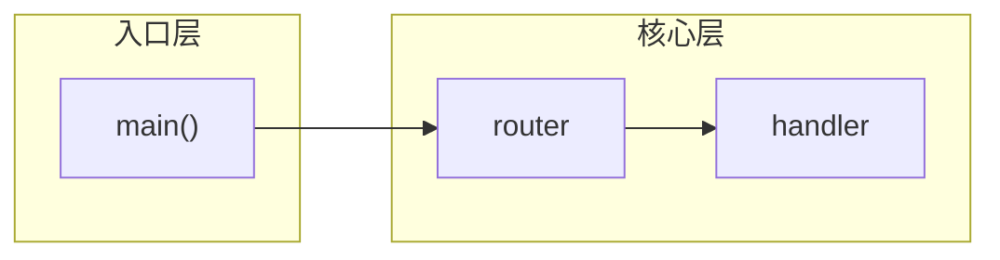

# Diagram Layout Guide

Rules for keeping Mermaid diagrams readable in rc929 HTML reports. Apply these **before** writing any `<pre class="mermaid">` block.

## Diagram type selection

| Question shape | Prefer |
|----------------|--------|
| Pipelines, ETL, batch jobs | `flowchart LR` / `graph` |
| Module/package dependencies | `graph` (classes/components as nodes) |
| Multi-party RPC, webhooks, agents | `sequenceDiagram` |
| State machines, modes | `stateDiagram-v2` |
| Layered architecture | `flowchart` with subgraphs |

## Complexity limits

| Rule | Rationale |
|------|-----------|
| Target **~8 nodes** per flowchart (10 hard cap) | Dagre and ELK both degrade beyond this |
| Max **12 edges** per flowchart | Hub nodes (e.g. Gateway) cause label collisions |
| Max **2 cross-subgraph** long-range edges | Long edges spanning layers create crossings |

If a draft exceeds these limits, split into 2–4 focused diagrams before writing HTML.

## When to split

### By concern

| Concern | Diagram type | Example |
|---------|--------------|---------|
| Request / RPC path | `sequenceDiagram` | Client → API → backends |
| Service topology | `flowchart LR` with subgraphs | One runtime layer only |
| Infra / observability | Small `flowchart TB` | Metrics scrape, cache |
| Package / module deps | `flowchart TB` or `graph TD` | Source tree only |

Do **not** combine infrastructure, client, service runtime, and package layers in one flowchart.

### By node count

| Question shape | When to split |
|----------------|---------------|
| Pipelines, ETL, batch jobs | Stages >8 nodes → one diagram per stage |
| Module/package dependencies | Package tree vs import graph → separate diagrams |
| Multi-party RPC, webhooks, agents | Never cram RPC into a flowchart |
| Layered architecture | **One layer per diagram** (infra / services / packages) |

## Syntax patterns

### Canonical minimal example

Use this shape for a two-layer topology diagram. Write it as a fenced ` ```mermaid ` block in the `.md` report; the converter wraps it in `.diagram-wrap > pre.mermaid` and places a `Sources:` line in `.diagram-caption`.

````
本节介绍入口层与核心层的协作关系，帮助读者在看图前建立分层认知。



Sources: `main.go:12`, `router.go:45` — 两层子图、短边、无跨层长连线。复杂架构请拆成多张图（见上文 When to split）。

图后说明各节点职责与数据如何在层间传递，以及图中未体现的错误路径或配置约束。
````

- **Subgraphs per layer** — declare nodes inside `subgraph sg_*` blocks; draw edges between adjacent layers, not diagonally across the whole canvas.
- **Direction** — `flowchart LR` for pipelines; `flowchart TB` only for shallow hierarchies (≤3 levels).
- **Node ordering** — list source nodes before targets so Dagre respects reading order.
- **Edge labels** — shorten repeated labels (`/predict` not `POST /predict` on every edge); explain the verb once in `diagram-caption`.
- **Optional deps** — use `-.->` for non-primary paths to reduce visual weight.

## Anti-pattern: multi-layer monolith

Do **not** pack entry scripts, cross-cutting concerns, runtime packages, domain logic, and foundation layers into one flowchart with hub fan-out (e.g. `gateway.py` → telemetry, metrics, config, and runtime). Five subgraphs plus bidirectional edges like `contracts/ <--> core/` produce crossing arcs even under ELK. Edges that cross subgraph borders (e.g. `n_cp_py --> n_cp` across layers) are the worst case for visual breaks — split so source and target share a subgraph when possible.

**Fix:** split into 2–3 focused diagrams:

1. Entry → runtime (services scripts to `gateway/`, `control_plane/`)
2. Domain → foundation (`policies/`, `backends/` to `contracts/`, `core/`)
3. Cross-cutting observability (telemetry, metrics, config) — small TB graph only

The converter **auto-applies ELK** when node/edge/subgraph/fan-out thresholds are exceeded, and prints a stderr warning nudging a split. Splitting is still preferred for readability.

## ELK layout

The shell loads Mermaid 11 + `@mermaid-js/layout-elk`. Default layout is Dagre with `curve: rounded` (orthogonal segments with small corner radius). The converter **auto-injects** `layout: elk` for dense flowcharts only — no curve override; manual frontmatter still works for override.

````
<pre class="mermaid">
---
config:
  layout: elk
  elk:
    nodePlacementStrategy: LINEAR_SEGMENTS
    mergeEdges: true
---
flowchart TB
  subgraph sg_api["API layer"]
    n_gw["gateway"]
  end
  ...
</pre>
````

Prefer splitting over ELK when possible. Auto-ELK improves routing but does not replace focused authoring.

## Analyzer integration

When writing codebase-analyzer output, include a **Suggested Diagrams** section that pre-splits architecture into focused scopes:

```markdown
### Suggested Diagrams
1. **[Scope name]** — type: `sequenceDiagram` | `flowchart LR` | `flowchart TB`
   - Nodes: `symbol1`, `symbol2`, …
   - Key edges: `A → B` (`path:line`)
2. **[Scope name]** — …
```

Each scope = one diagram; keep ≤8 nodes. Do not merge infra, runtime, and package layers into one scope.

## Checklist (diagram-specific)

- [ ] No flowchart exceeds 10 nodes or 12 edges
- [ ] Multi-layer architecture split into ≥2 diagrams (or one `sequenceDiagram` + one topology diagram)
- [ ] Request/RPC flows use `sequenceDiagram` where applicable
- [ ] Edge labels readable without overlap; use fullscreen to verify dense diagrams
