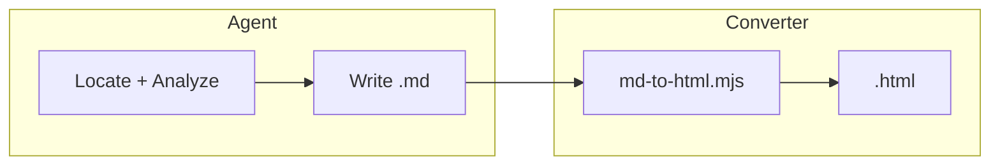

# Markdown Report Guide

Agents write research content as **Markdown** per this schema. A bundled script (`scripts/md-to-html.mjs`) converts it into the self-contained HTML report using `html-shell-template.html`.

**Do not** read or copy `html-shell-template.html` into context at build time — write `.md` here, then run the converter.

---

## Filename & path

- Pattern: `<YYYY-MM-DD>-research-<kebab-topic>.md`
- Default directory: `thoughts/research/` (override when user specifies a custom output path; use `-o` on the converter for custom `.html` path)

---

## Frontmatter

Wrap metadata in YAML fences at the top of the file.

### Required fields

| Field | Maps to | Notes |
|-------|---------|-------|
| `title` | `{{TITLE}}`, `{{HERO_TITLE}}` | Report title; plain text, one line |
| `question` | `{{QUESTION}}` | Original research question verbatim |
| `date` | Meta pill | ISO date `YYYY-MM-DD` |

### Optional fields

| Field | Maps to | Default |
|-------|---------|---------|
| `eyebrow` | `{{HERO_EYEBROW}}` | `rc929 Research` |
| `repo` | Meta pill | omitted |
| `commit` | Meta pill | omitted |
| `branch` | Meta pill | omitted |
| `footer` | `{{FOOTER}}` | `Generated by rc929` |

Example:

```yaml
---
title: "rc929 工作流追踪"
eyebrow: "rc929 Research"
question: "Trace the rc929 research workflow from intake through handoff"
repo: "OTLorz2/rc929"
date: "2026-06-07"
commit: "5ee83a1"
branch: "md-to-html"
footer: "Generated by rc929"
---
```

---

## Body syntax

Use `##` headings for top-level sections. **Every section must include a `{#slug}` anchor** matching the HTML `id`.

| Construct | Markdown syntax | HTML output |
|-----------|-----------------|-------------|
| Section | `## 要点 {#summary}` | `<section id="summary">` + auto `.section-num` from order |
| Prose | Plain paragraphs under `##` | `<div class="section-prose"><p>…</p></div>` |
| Summary list | Ordered list in `#summary` | `<ol class="summary-list">` |
| Unordered list | `-` bullets (e.g. in `#gaps`) | `<ul>` |
| Mermaid | ` ```mermaid ` fenced block | `.diagram-wrap > pre.mermaid` |
| Diagram caption | Line starting `Sources:` immediately after mermaid fence | `<p class="diagram-caption">` |
| Evidence | `:::evidence{file="path" lines="1-20" lang="json"}` … `:::` | `<details>` in `.evidence-stack` |
| Inline ref | `` `path:line` `` in prose | `<code class="ref">` |
| Bold in list | `**Topic**` in list items | `<strong>` |

Section numbers (`01`, `02`, …) and TOC entries are **generated by the converter** from `##` order — do not number sections manually.

---

## Section rules

1. **Every section** must have at least one prose paragraph (≥2 sentences total) in a `.section-prose` equivalent — plain paragraphs under the heading count.
2. **Sections with Mermaid** must have prose **before** the diagram block AND **after** the `Sources:` caption (each ≥80 characters).
3. **Mermaid subgraph/node ids** must use `sg_` / `n_` prefixes and must not equal any section slug.
4. **`#summary`** should include an ordered list of key findings with `path:line` refs.
5. **TOC label** equals the heading text before `{#slug}` — e.g. `## 要点 {#summary}` → TOC shows `要点`.

---

## Evidence blocks

Use fenced directives (not standard markdown):

```markdown
:::evidence{file="SKILL.md" lines="101-114" lang="md"}
### 5. Build the single HTML file
...
:::
```

| Attribute | Required | Purpose |
|-----------|----------|---------|
| `file` | yes | Shown in `<summary>` and `code.ref` |
| `lines` | yes | Line range in `code.ref` |
| `lang` | yes | Maps to `pre.snippet.language-*` (see table below) |

Language mapping (`lang` attribute → highlight.js class):

| `lang` | Class |
|--------|-------|
| `json` | `language-json` |
| `md` | `language-markdown` |
| `py` | `language-python` |
| `go` | `language-go` |
| `ts`, `tsx` | `language-typescript` |
| `js`, `jsx` | `language-javascript` |
| `yaml`, `yml` | `language-yaml` |
| `sh` | `language-bash` |

---

## Validation (enforced by converter)

The script exits non-zero with error messages when:

- Required frontmatter (`title`, `question`, `date`) is missing
- A `##` heading lacks `{#slug}`
- A section with Mermaid lacks prose before the diagram or after the caption (≥80 chars each)
- A section slug appears as a bare Mermaid node id (without `sg_`/`n_` prefix)

Warnings (non-fatal):

- `#summary` section has no ordered list

---

## Complete example

Save as `thoughts/research/2026-06-07-research-workflow-trace.md`:

```markdown
---
title: "rc929 工作流追踪"
eyebrow: "rc929 Research"
question: "Trace the rc929 research workflow from intake through handoff"
repo: "OTLorz2/rc929"
date: "2026-06-07"
commit: "5ee83a1"
branch: "md-to-html"
---

## 要点 {#summary}

rc929 将研究问题收敛为单一 HTML 报告。Issue #6 引入 Markdown 中间格式，由脚本注入 HTML shell，减少 agent 生成 boilerplate 的 token 开销。

1. **工作流编排**：七步流程定义于 `SKILL.md:29–150`，探索后合成内容并交付 HTML。
2. **HTML shell**：`html-shell-template.html` 提供 CSS、JS 与布局占位符，agent 不再手写 shell。
3. **转换脚本**：`scripts/md-to-html.mjs` 读取本 markdown 并注入 shell，产出最终 `.html`。

## 架构概览 {#diagrams}

本节描述 Issue #6 实施后的报告生成路径。Agent 负责探索与撰写 Markdown；转换脚本负责将内容注入静态 HTML shell，浏览器端 Mermaid 与 highlight.js 行为保持不变。



Sources: `SKILL.md:76-88`, `scripts/md-to-html.mjs`

上图展示了职责分离：agent 只产出语义内容（约 3–15 KB），脚本复用约 30 KB 的 shell boilerplate。最终用户仍获得可交互的单文件 HTML 报告。

## 关键证据 {#evidence}

:::evidence{file="SKILL.md" lines="13-13" lang="md"}
2. **Exactly one deliverable** — One `.html` file, self-contained (inline CSS/JS; CDN only for fonts/mermaid if needed). No companion markdown, no folder of assets unless embedded as data URLs.
:::

## 待验证 {#gaps}

- **模板同步后的映射**：若 `template.html` 同步改变了 shell class 名称，需同步更新本 guide 与 converter（待验证具体流程）。
```

Convert:

```bash
node .claude/skills/rc929/scripts/md-to-html.mjs thoughts/research/2026-06-07-research-workflow-trace.md
```

---

## Shell placeholder reference (for converter authors)

| Placeholder | Set by converter from |
|-------------|----------------------|
| `{{TITLE}}` | `title` |
| `{{HERO_EYEBROW}}` | `eyebrow` |
| `{{HERO_TITLE}}` | `title` |
| `{{META_PILLS}}` | `repo`, `date`, `commit`, `branch` |
| `{{QUESTION}}` | `question` |
| `{{TOC_ITEMS}}` | All `##` sections in order |
| `{{MAIN_CONTENT}}` | Rendered section HTML |
| `{{FOOTER}}` | `footer` |

HTML output conventions (`.section-prose`, Mermaid ids, evidence classes) remain defined in `html-report-guide.md`.
