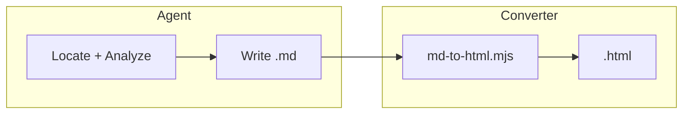

## 要点 {#summary}

rc929 将研究问题收敛为单一 HTML 报告。Issue #6 引入 Markdown 中间格式，由脚本注入 HTML shell，减少 agent 生成 boilerplate 的 token 开销。本 fixture 用于 golden-file 测试转换器行为。

1. **工作流编排**：七步流程定义于 `SKILL.md:29–150`，探索后合成内容并交付 HTML。
2. **HTML shell**：`html-shell-template.html` 提供 CSS、JS 与布局占位符，由 `md-to-html.mjs` 注入内容。
3. **转换脚本**：`scripts/md-to-html.mjs` 读取本 markdown 并注入 shell，产出最终 `.html`。

## 架构概览 {#diagrams}

本节描述 Issue #6 实施后的报告生成路径。Agent 负责探索与撰写 Markdown；转换脚本负责将内容注入静态 HTML shell，浏览器端 Mermaid 与 highlight.js 行为保持不变，用户仍获得可交互的单文件报告。

Sources: `SKILL.md:76-88`, `scripts/md-to-html.mjs`

上图展示了职责分离：agent 只产出语义内容（约 3–15 KB），脚本复用约 30 KB 的 shell boilerplate。TOC、Mermaid 全屏、证据面板语法高亮均由 shell 内嵌 JS 在浏览器端完成，转换器不重复实现这些能力。

## 关键证据 {#evidence}

以下片段来自 SKILL.md 非协商条款，说明最终交付物仍为单一 HTML 文件（中间 markdown 由 Issue #6 新增）。

:::evidence{file="SKILL.md" lines="12-13" lang="md"}
1. **Accuracy first** — Every claim needs evidence (`path:line` or quoted symbol). If uncertain, mark `待验证` and do not draw it in diagrams as fact.
2. **Exactly one deliverable** — One `.html` file, self-contained (inline CSS/JS; CDN only for fonts/mermaid if needed).
:::

## 待验证 {#gaps}

- **模板同步后的映射**：若 `template.html` 同步改变了 shell class 名称，需同步更新 markdown-report-guide 与 converter（待验证具体流程）。
